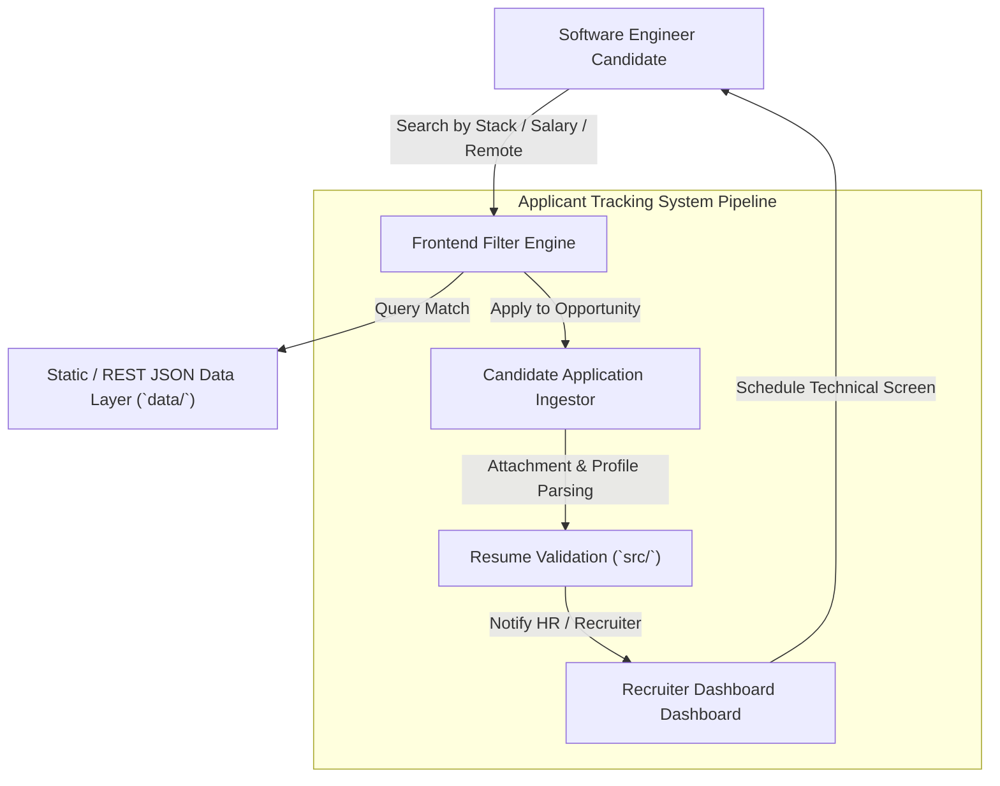

# 💼 Q1 Jobs — Tech Career & Recruitment Board

> **Job board platform for tech professionals connecting top talent with high-impact software engineering roles.**

[](https://developer.mozilla.org/en-US/docs/Web/JavaScript)
[](https://github.com/kreftamarcio/q1jobs/actions)
[](https://github.com/kreftamarcio/q1jobs)
[](https://opensource.org/licenses/MIT)

---

## Overview

Q1 Jobs is a focused recruitment and career marketplace engineered for software developers, product managers, and UI/UX designers. It delivers an intuitive, fast applicant tracking experience with dynamic filtering by technical stack (`TypeScript`, `React`, `Python`, `Go`), remote work eligibility, and compensation brackets.

## Applicant Tracking & Search Architecture



## Features

- 🔍 **Real-Time Job Filtering:** Search and segment opportunities by stack, seniority level, and geographical flexibility instantly.
- 🚀 **Streamlined Application Workflow:** Candidate profile submission and resume attachment pipeline designed to maximize conversion rates.
- 📱 **Mobile-First Responsive Layout:** Fluid CSS grid architecture optimized for on-the-go browsing and recruiter reviews.
- 🛠️ **Modular Data Layer:** Clean JSON/REST data models allowing straightforward integration with external ATS backends.

## Tech stack

- **Frontend & Logic:** JavaScript (ESNext), HTML5 Semantic Architecture
- **Styling:** Vanilla CSS / Modern Flexbox & Grid layouts
- **Deployment:** Static & Serverless Cloud Hosting

## Screenshots

> Interactive job listing cards and candidate profile modals will be attached after the upcoming visual overhaul.

## Getting started

### Prerequisites

- Node.js (`v20+` if running local build server)
- Modern Web Browser (`Chrome`, `Firefox`, `Safari`, `Edge`)

### Installation

```bash
git clone https://github.com/kreftamarcio/q1jobs.git
cd q1jobs
npm install
```

### Environment variables

Copy `.env.example` to `.env.local` to define your API endpoint targets:

```bash
cp .env.example .env.local
```

| Variable | Required | Description |
| :--- | :--- | :--- |
| `API_BASE_URL` | Yes | Backend job listing API endpoint (`https://api.q1jobs.com/v1`) |
| `ANALYTICS_KEY` | No | Anonymous recruitment conversion tracking key |

### Development

You can serve the platform locally using any static HTTP server or Node utility:

```bash
# Using npx serve
npx serve . -p 3000
```

Open [http://localhost:3000](http://localhost:3000) in your browser.

### Build

```bash
# If using a bundling step
npm run build
```

### Tests

```bash
npm test
```

## Project structure

```text
q1jobs/
├── .github/
│   └── workflows/       # Automated static asset syntax verification CI
├── archive/             # Historical zip distribution archives
├── aws/                 # Cloud infrastructure & deployment manifests
├── data/                # Mock job listings and candidate schemas
├── public/              # Static media and public stylesheets
├── src/                 # Core application logic, search filtering, and ATS pipelines
└── test/                # Local test suites and validation scripts
```

## Roadmap

- Add automated salary benchmarking calculator for software engineers.
- Build recruiter analytics dashboard for tracking application funnel metrics.
- Support one-click GitHub profile import for developer candidates.

## Contributing

Please review our [CONTRIBUTING.md](CONTRIBUTING.md) guide before opening Pull Requests.

## License

Distributed under the **MIT License** - see the [LICENSE](LICENSE) file for details.
